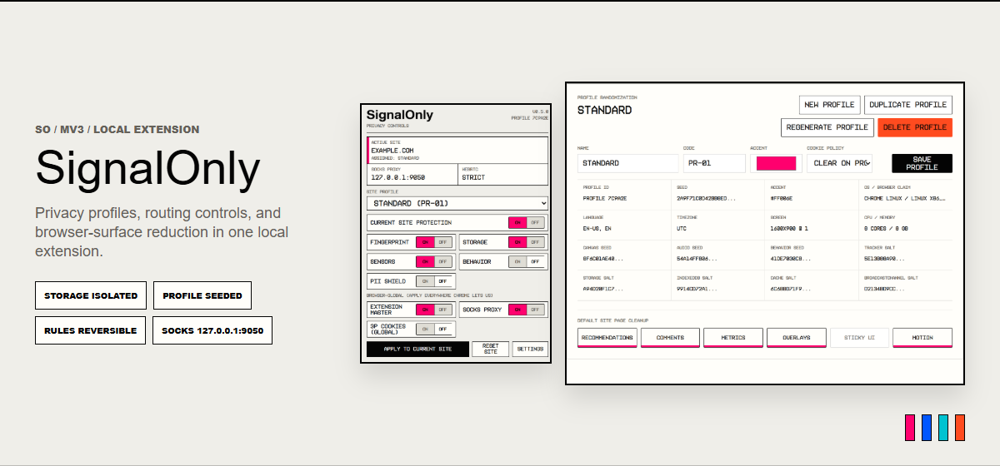

# SignalOnly

SignalOnly is a local Chromium extension for alt management, per-site identity profiles, fingerprint spoofing, cookie separation, SOCKS routing, WebRTC leak control, and cleaner browsing.

The main use is simple: keep different site identities separated without constantly switching Chrome profiles, clearing cookies manually, or rebuilding the same setup over and over.

Assign a profile to a site, and SignalOnly gives that site a stable alternate browser surface. The profile carries its own fingerprint values, storage salts, cookie jar, cleanup rules, and routing settings.

This is useful for alt accounts, privacy testing, account separation, and making noisy sites less annoying without breaking every login flow.

## How it works

SignalOnly runs as a Manifest V3 extension. The background worker handles profiles, site assignments, proxy settings, privacy controls, exclusions, dynamic rules, and cookie jars. The content script runs early on pages and injects the shield when the current site has an active profile.

The shield changes the browser signals that sites usually read when they try to identify you. Instead of leaking the same raw browser state everywhere, each assigned profile gets its own stable surface. The goal is not random noise every reload. The goal is a believable profile that stays consistent.

Cookie handling works per host and profile. When you switch a site from one profile to another, SignalOnly can save the current cookies, clear them, and restore the cookies for the selected profile. That makes alt switching much less annoying because you are not constantly logging in and out by hand.

Storage is separated with profile salts, so normal page storage does not directly bleed between assigned profiles. The extension also has optional cleanup rules for recommendations, comments, overlays, sticky junk, metrics, and motion-heavy page elements.

## Why this exists

Most privacy extensions are built like blunt instruments. They block too much, break pages, and then expect you to babysit every site.

SignalOnly is meant to be more controlled. Keep the page working, but change what the page sees. Give each site a profile. Keep cookies separated. Keep browser signals consistent. Route traffic through SOCKS when needed. Hide the parts of the page that are just attention trash.

It is not trying to be a giant hardened browser project. It is a practical local tool for managing identities inside Chromium.

## Install

Open `chrome://extensions`, enable Developer mode, click Load unpacked, and select the folder containing `manifest.json`.

Then open a normal website, click the SignalOnly icon, and assign a profile to the current site.

## Usage

Use the popup for quick current-site changes.

Use the options page for profiles, exclusions, cookie jars, imports, exports, and global settings.

After changing fingerprint or storage behavior, reload the page. A lot of sites read browser APIs early, so reloads matter.

Use exclusions for sites where you want SignalOnly completely out of the way, especially login providers, payment flows, or anything that acts weird when browser signals change.

## Testing

The basic test is to assign Profile A to a fingerprint test page, reload, and confirm the result stays stable. Then switch to Profile B, reload, and confirm the surface changes. Switch back to Profile A and check that the old surface and cookies return.

Also test the actual sites you care about.

## Project layout

`manifest.json` defines the extension.

`src/background/service-worker.js` handles extension state, profiles, site assignments, cookie jars, proxy controls, rules, and exclusions.

`src/content/content.js` runs on pages and applies the current site config.

`src/injected/fingerprint.js` patches page-world browser APIs.

`popup/` is the quick control panel.

`options/` is the full manager.

`rules/static-rules.json` contains the baseline tracker rules.

## Notes

SignalOnly is local. Profiles, salts, site assignments, and saved cookie jars live in Chrome extension storage.

Exports can contain profile and cookie data. Treat exported configs like private files.
